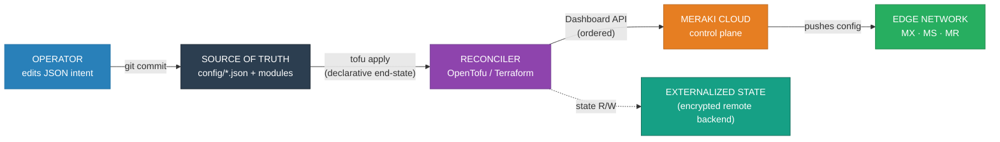
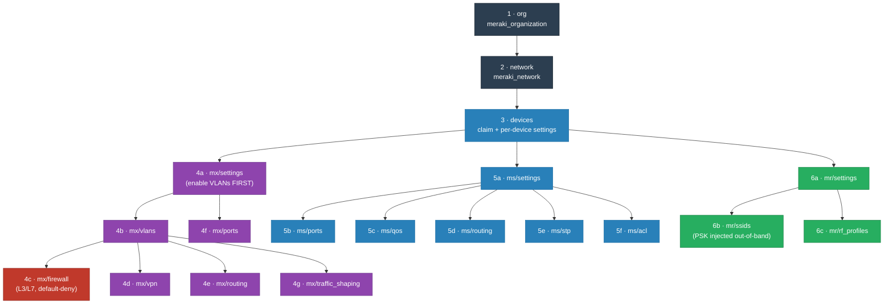
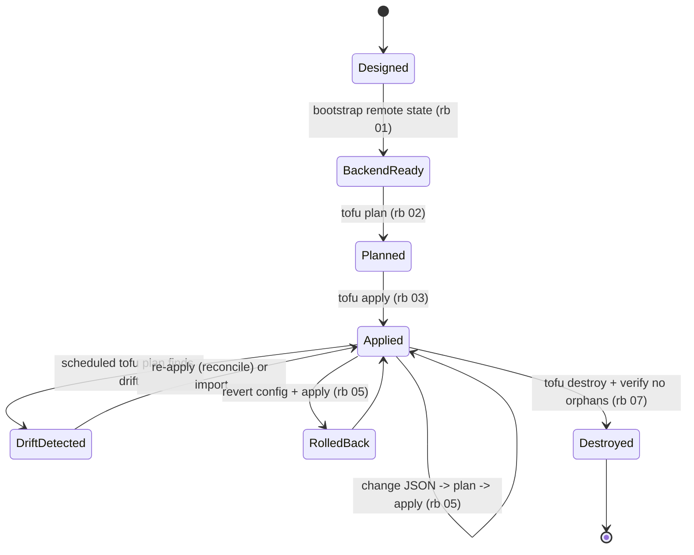

# Meraki Edge Network

### Infrastructure-as-Code for a complete Cisco Meraki edge — security appliance, switching, and wireless managed as one declarative, version-controlled artifact.

> **Engineering Philosophy / Thesis:** An edge network configured by hand is a liability hiding in
> plain sight — every VLAN, firewall rule, and SSID lives only in a console, unreviewed, undiffable,
> and one fat-fingered click away from black-holing a site. The naive answer is "write a script";
> but a script owns its own idempotency and can't tell you when reality has drifted. The
> production answer is to treat the network as **declared end-state**: the entire intent of a site
> is structured data, every change is a peer-reviewed plan, drift detection is free, and rebuilding
> a site is an apply — not a day of clicking. This repo is that, with **trust-zone segmentation** as
> the load-bearing security control and **no secret ever in the artifact.**

<!-- START_GENERATED:docs/diagrams/src/hero.mermaid -->

<!-- END_GENERATED:docs/diagrams/src/hero.mermaid -->

---

This is built to manage a real Cisco Meraki edge through the **Dashboard API** — the same control
plane the GUI uses, so there is no gap between "what was clicked" and "what is enforced." It is
written against a **single edge site** as the primary profile, with multi-site as an additive
extension; it is deliberately agnostic about the reconciler engine (OpenTofu *or* Terraform) and the
state backend, and it leaves org-wide governance and firmware *actions* out of scope on purpose.

## Table of Contents

- [Business Case](#business-case)
- [Cost Model](#cost-model)
- [Why This Approach](#why-this-approach)
- [The Welds](#the-welds)
- [Architecture at a Glance](#architecture-at-a-glance)
- [Key Architecture Decisions](#key-architecture-decisions)
- [Lifecycle, Operations & Support](#lifecycle-operations--support)
- [Repository Layout](#repository-layout)
- [Prerequisites & Dependencies](#prerequisites--dependencies)
- [Quick Start](#quick-start)
- [Design Docs](#design-docs)
- [Scope & Constraints](#scope--constraints)
- [License](#license)

---

## Business Case

> **Business accumen first. What are we solving, and why is it worth solving — in money and time.**

The hardware/licensing floor of a Meraki edge is fixed no matter how you manage it. The *avoidable*
cost is **toil and the asymmetric risk of a bad change.** A manual edge edit is ~15–45 minutes of
unreviewed click-through with no audit trail and invisible drift; a wrong firewall rule can take a
site down for an hour or two — and both costs scale **linearly with every site you add.**

Managing the edge as reviewed, declarative code collapses the change to *edit JSON → read the diff →
apply*, gives every change a git history and a peer-reviewable plan, makes drift detection free (the
plan **is** the drift report), and turns rollback into `git revert`.

### Financial Comparison Matrix

| Expense Class | Status Quo (manual Dashboard) | Alternative (bespoke script/SDK) | **This Design (declarative IaC)** |
|---|---|---|---|
| **Initial CapEx** | $0 tooling | dev time to build + maintain a tool | authoring effort (one-time) |
| **Recurring OpEx** | ~$750/mo operator toil¹ | ~$500/mo toil + you own idempotency | ~$250/mo toil + ~cents state/CI |
| **MTTR (bad change)** | ~60–120 min, re-click from memory | partial; you build rollback | ~10–20 min, `git revert` + apply |
| **Change audit / drift** | none / invisible | commit, but no end-state | full git history; `plan` = drift detector |
| **Multi-site scaling** | linear (re-click each site) | re-run, hope it's idempotent | near-zero marginal (new `config/` set) |

¹ Assumptions sourced in [COST-MODEL §2](docs/COST-MODEL.md#2-operational--runtime-plane--operate-the-network-as-code): 20 changes/mo × time/change × $75/hr loaded.

*ROI Conclusion:* against a manual baseline, the team's modeling shows **≈ $935/month per operator in
avoided toil and avoided change-failure downtime** — and unlike the manual baseline, that number does
not get worse as sites multiply. It pays for itself inside the first month of multi-change operation.

---

## Cost Model

> Summary only — full sourced breakdown in **[docs/COST-MODEL.md](docs/COST-MODEL.md)**.

Two cost planes, kept separate because they behave differently:

| Plane | What drives it | This design's posture | Est. (1 reference site) |
|---|---|---|---|
| **Infrastructure** | hardware (CapEx, amortized) + per-device licensing + ISP/circuit | fixed platform floor — same whether managed by hand or by code | ~$148–$512/mo |
| **Operational / runtime** | change toil + change-failure downtime + API/state mechanics | declarative + reviewed diffs + bounded blast radius | **≈ −$935/mo avoided** vs manual |

- **Hardware vs licensing:** the dominant *recurring* line is **per-device licensing**, not hardware
  — and it **co-terminates** across the org, so claiming a device can re-price the whole license pool
  ([COST-MODEL §1](docs/COST-MODEL.md#1-infrastructure-plane--own-and-run-the-edge)).
- **Toil & change-failure:** the repo's real ROI lives in §2 — reviewed plans, free drift detection,
  and `git revert` rollback ([COST-MODEL §2](docs/COST-MODEL.md#2-operational--runtime-plane--operate-the-network-as-code)).
- ⚠️ **Operational cost traps:** a **device-claim apply is a budget event** (license co-term); a
  **scheduled `apply`** can reconcile away an emergency hand-edit; **parallel applies** trigger API
  rate-limit storms. Full list: [COST-MODEL §3](docs/COST-MODEL.md#3-️-runtime--operational-cost-traps-read-before-deploying).

---

## Why This Approach

**Declarative over imperative — for state.** Network configuration is a desired-state problem: you
describe what should be true and let the reconciler compute the diff. Idempotency comes for free,
drift becomes detectable, and every change is a reviewable plan. Imperative tooling is kept for genuine
*actions* (firmware, emergency shutdown), not for state. *(See [ADR-0001](docs/adr/0001-declarative-over-imperative.md).)*

**Configuration as data, not as code.** Intent lives in JSON shaped to mirror the Dashboard API, so
payloads copy near-verbatim from the docs and the 19 modules never change to add a setting — you edit
data. *(See [ADR-0002](docs/adr/0002-json-driven-config-pattern.md).)*

**Segmentation is the security control.** The edge is where the least-trusted devices live, so trust
zones — each its own L3 VLAN — are first-class, and inter-zone traffic is an **explicit, logged
default-deny**. *(See [ADR-0003](docs/adr/0003-trust-zone-vlan-segmentation.md) · [ADR-0004](docs/adr/0004-default-deny-firewall.md).)*

**Secrets never touch the artifact.** Only structure is committed; the API key and PSKs materialize at
runtime. The repo is safe to publish as-is. *(See [ADR-0005](docs/adr/0005-secrets-out-of-repo.md).)*

---

## The Welds

If you read nothing else: this repo turns a hand-clicked Meraki edge into a **declarative, reviewed,
recoverable artifact** — the whole site's intent (segments, firewall, switching, wireless) is JSON
that an OpenTofu/Terraform reconciler enforces through the Dashboard API, in an order that mirrors the
platform's own hierarchy, with secrets injected at runtime and state externalized for recovery. The
welds — where this departs from the out-of-the-box shape — are below, in primitives.

| Weld | Out of the box (manual / scripted) | What this repo does |
|---|---|---|
| **Change primitive** | a live click, or an imperative API call you must make idempotent | a reviewed `plan` → `apply` of declared end-state; idempotent by construction |
| **Config primitive** | settings buried in a console; or values fused into code | JSON shaped like the Dashboard API; modules stay stable, you edit data |
| **Security primitive** | flat network or implicit allow | trust-zone L3 segmentation + explicit, logged default-deny |
| **Drift primitive** | invisible until something breaks | `tofu plan` *is* the drift detector; scheduled read-only plan alerts |
| **Secret primitive** | key/PSK pasted into config or tfvars | runtime-injected env/secret-store; nothing value-bearing in the repo |
| **Ordering primitive** | tribal knowledge ("enable VLANs first") | explicit `depends_on` chain mirroring org→network→devices→features |
| **Recovery primitive** | rebuild from memory | re-derive the whole site from git + encrypted remote state |

---

## Architecture at a Glance

The module dependency chain — apply order mirrors the Meraki Dashboard hierarchy, and `depends_on`
enforces the platform's side-effect ordering (enable VLANs before creating them; claim a device
before configuring its ports):

<!-- START_GENERATED:docs/diagrams/src/architecture_at_a_glance.mermaid -->

<!-- END_GENERATED:docs/diagrams/src/architecture_at_a_glance.mermaid -->

---

## Key Architecture Decisions

The load-bearing calls are documented as [Architecture Decision Records](docs/adr/README.md) — each
stating the alternatives that were genuine candidates and *why they lost*, not just the chosen answer.

| ADR | Decision | Rejected alternatives |
|---|---|---|
| [0001](docs/adr/0001-declarative-over-imperative.md) | Declarative end-state over imperative scripting | manual Dashboard; imperative SDK/playbooks |
| [0002](docs/adr/0002-json-driven-config-pattern.md) | JSON-driven, Dashboard-shaped config | typed HCL vars; values-in-HCL |
| [0003](docs/adr/0003-trust-zone-vlan-segmentation.md) | Trust-zone VLAN segmentation as core control | flat L2; per-host microsegmentation |
| [0004](docs/adr/0004-default-deny-firewall.md) | Explicit, logged default-deny firewall | default-allow + blocklist; implicit default-deny |
| [0005](docs/adr/0005-secrets-out-of-repo.md) | Secrets materialized at runtime | encrypted-in-git (SOPS); plaintext tfvars |
| [0006](docs/adr/0006-dependency-ordering.md) | Explicit `depends_on` matching the hierarchy | implicit ordering; synthetic "ready" outputs |
| [0007](docs/adr/0007-opentofu-vs-terraform.md) | OpenTofu/Terraform-compatible, operator's choice | Terraform-only (BSL); OpenTofu-only |
| [0008](docs/adr/0008-deployment-profile-single-site.md) | Single edge site as the primary profile | multi-site shared state; multi-site isolated state |

---

## Lifecycle, Operations & Support

The full lifecycle is owned here — **provision → deploy → operate → maintain → decommission** — not
just day-zero install. The operating model (monitoring, drift, license/spend, support tiers,
break-fix) lives in **[docs/OPERATIONS.md](docs/OPERATIONS.md)**.

<!-- START_GENERATED:docs/diagrams/src/lifecycle.mermaid -->

<!-- END_GENERATED:docs/diagrams/src/lifecycle.mermaid -->

| Phase | Owns | Where |
|---|---|---|
| **Day-0 Provision** | encrypted remote state, API key + PSKs, org/network/device claim, license headroom | [OPERATIONS](docs/OPERATIONS.md#day-0--provision-stand-it-up) + [rb 01–03](docs/runbooks/README.md) |
| **Day-1 Deploy** | full `plan`→reviewed diff→`apply` + smoke test + proven rollback | [rb 04](docs/runbooks/profile-single-site/04-plan-and-apply/RUNBOOK.md) |
| **Day-2 Operate** | drift detection, license/**spend**, change loop, state restore drills | [OPERATIONS](docs/OPERATIONS.md#day-2--operate-run-it-like-it-matters) |
| **Support / break-fix** | self-correct → operator → vendor escalation | [OPERATIONS](docs/OPERATIONS.md#support-model--break-fix) |
| **Day-N Decommission** | destroy, release devices, park licenses, **no orphaned state/bucket** | [rb 07](docs/runbooks/_common/07-decommission/RUNBOOK.md) |

Each transition is a documented runbook, not a tribal-knowledge checklist. **Runbooks are split by
[deployment profile](docs/runbooks/README.md#the-deployment-profile-model)** — `single-site` is
written concretely, with `multi-site` as an additive extension that reuses every module unchanged.

---

## Repository Layout

```
meraki-edge-network-terraform-v2/
├── README.md                  # you are here — business case, justification, summary, links
├── LICENSE                    # MIT
│
├── docs/
│   ├── HLD.md                 # vendor-AGNOSTIC: controls, protocols, patterns, the "what & why"
│   ├── LLD.md                 # vendor-SPECIFIC: products, addresses, apply order, profiles
│   ├── COST-MODEL.md          # infra plane (hardware/licensing/circuit) + operational plane + traps
│   ├── OPERATIONS.md          # Day-0/1/2 + monitoring (drift + spend) + support tiers + decommission
│   ├── adr/                   # 8 MADR decision records — alternatives considered + why they lost
│   ├── diagrams/src/          # Mermaid sources (single source of truth, injected into docs)
│   └── runbooks/              # split by deployment profile:
│       ├── _common/                 #   bootstrap-backend · update-and-rollback · decommission
│       ├── profile-single-site/     #   PRIMARY: provision · secrets · apply · drift · troubleshoot
│       └── profile-multi-site/      #   EXTENSION: fan out per site, reuse the modules
│
├── terraform/                 # THE artifact: root composition + 19 modules + config.example/ JSON
│
└── scripts/                   # validate.sh (CI gate mirror) · preflight.sh · build_docs.py (DRY diagrams)
```

## Prerequisites & Dependencies

| Tool | Version | Install | Purpose |
|---|---|---|---|
| **OpenTofu** | ≥ 1.5.0 | `brew install opentofu` · [opentofu.org/docs/intro/install](https://opentofu.org/docs/intro/install/) | Open-source reconciler engine (recommended) |
| **Terraform** | ≥ 1.5.0 | `brew install terraform` · [developer.hashicorp.com/terraform/install](https://developer.hashicorp.com/terraform/install) | Alternative to OpenTofu |
| **CiscoDevNet/meraki** provider | ≥ 1.0.0 | auto-installed by `tofu init` / `terraform init` | Meraki Dashboard API provider |
| **Git** | any | `brew install git` · [git-scm.com/downloads](https://git-scm.com/downloads) | Version control + `git revert` rollback |
| **Python 3** | ≥ 3.8 | preinstalled on macOS, or `brew install python` | Runs `scripts/build_docs.py` + `validate.sh` doc-sync gate |
| **Meraki Dashboard API key** | — | Dashboard → Organization → Settings → API access | Authenticates Dashboard API calls |

> **Engine choice:** this repo is compatible with **both OpenTofu and Terraform** — the version
> floor (`>= 1.5.0`) and provider pin live in [`terraform/versions.tf`](terraform/versions.tf). All
> examples use `tofu`; substitute `terraform` verbatim everywhere. The API key is **never committed**
> — it materializes at runtime from the environment ([ADR-0005](docs/adr/0005-secrets-out-of-repo.md)).

## Quick Start

> Full detail in [`docs/runbooks/`](docs/runbooks/README.md). Placeholders (`REPLACE_*`, RFC 5737
> documentation addresses) must be adapted to your environment.

```bash
# 1. Bootstrap secrets (never committed) and config
export MERAKI_DASHBOARD_API_KEY="REPLACE_API_KEY"
export TF_VAR_ssid_psks='{"edge-trusted":"REPLACE","edge-iot":"REPLACE","edge-guest":"REPLACE"}'
cp -r terraform/config.example terraform/config      # edit org id + device serials

# 2. Apply the declared end-state (OpenTofu shown; `terraform` substitutes verbatim)
( cd terraform && tofu init && tofu plan && tofu apply )

# 3. Verify + keep docs in sync
scripts/validate.sh            # reproduce the CI gate locally (fmt/validate + doc-sync + secret scan)
python3 scripts/build_docs.py  # re-inject diagrams after editing a .mermaid source
```

## Design Docs

- **[High-Level Design](docs/HLD.md)** — vendor-agnostic: the problem, the keystone segmentation
  constraint, goals/non-goals, controls/protocols, lifecycle, risk register.
- **[Low-Level Design](docs/LLD.md)** — vendor-specific: deployment profiles, the 19 modules,
  apply order, JSON schema gotchas, concrete secret wiring, failure modes.
- **[Cost Model](docs/COST-MODEL.md)** — infrastructure plane (hardware/licensing/circuit) +
  operational plane (toil, change-failure, API/state) + the operational cost traps.
- **[Operations & Support](docs/OPERATIONS.md)** — Day-0/1/2, monitoring (drift + license/spend),
  support tiers, break-fix, clean decommission.
- **[Architecture Decision Records](docs/adr/README.md)** — MADR format, each with the alternatives
  genuinely considered and why they were rejected.

## Scope & Constraints

- **In scope:** one Meraki edge network as declarative code — MX (security/L3/SD-WAN), MS (switching),
  MR (wireless); trust-zone segmentation; default-deny firewall; runtime secrets; encrypted remote
  state; single-site primary profile + multi-site extension.
- **Out of scope (intentionally):** org-wide governance (SAML, adaptive policy, admin RBAC);
  multi-site orchestration framework; firmware/emergency *actions* (imperative, out of band); the
  choice of state backend and reconciler engine (operator's).
- **Known constraints / accepted risks:** the platform is **inert without an active subscription** and
  config changes degrade if the cloud control plane is unreachable (SD-WAN trade-off); per-device
  licensing **co-terminates** (a claim is a budget event); the Dashboard API is rate-limited (serialize
  applies). See the [HLD risk register](docs/HLD.md#12-risks--open-questions).

## License

MIT — see [LICENSE](LICENSE).
