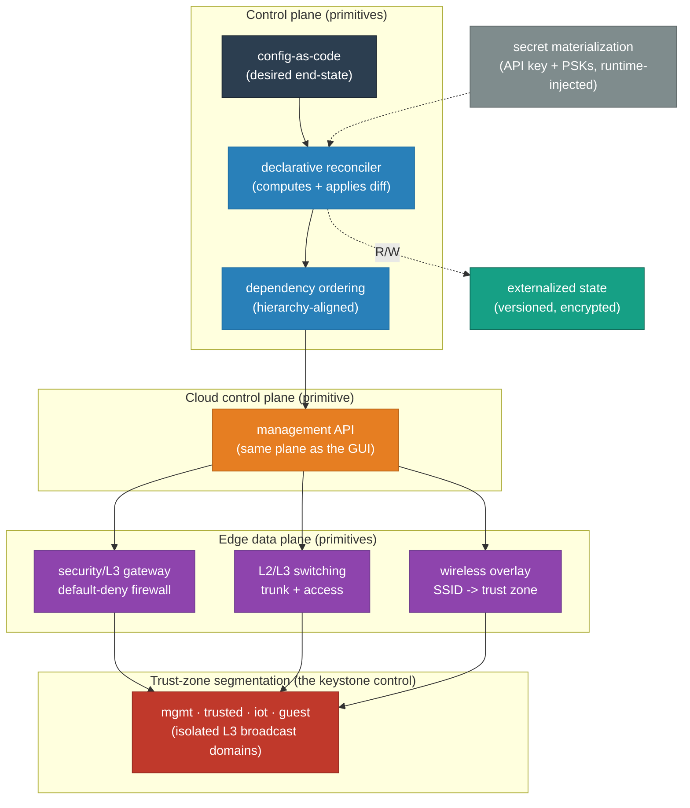
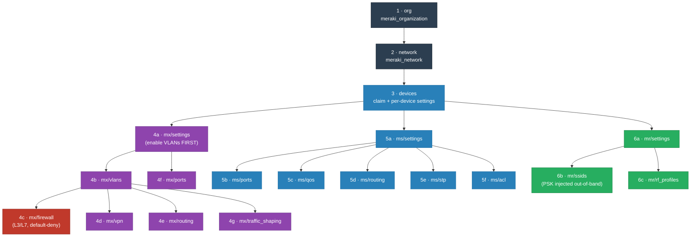
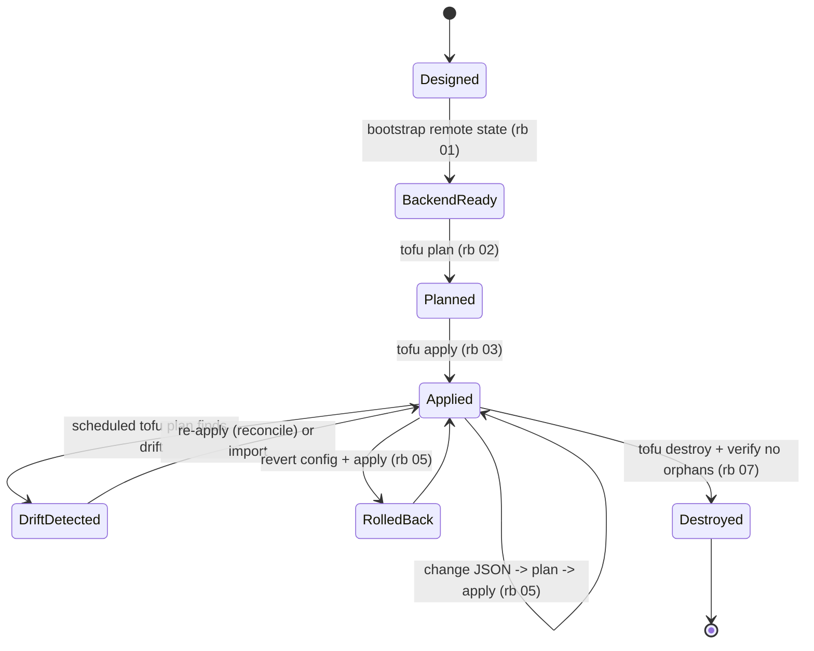

# Meraki Edge Network — High-Level Design

<!-- START_GENERATED:docs/diagrams/src/hld_overview.mermaid -->

<!-- END_GENERATED:docs/diagrams/src/hld_overview.mermaid -->

The picture above is the whole argument before a word of prose: a config-as-code source of truth,
a declarative reconciler that enforces it through a cloud control plane, and an edge whose security
posture is anchored in trust-zone segmentation. Everything below is *why* it has that shape. The
concrete products — which appliance, which provider, which addresses — live in the
[LLD](LLD.md); this document names none of them on purpose.

## Contents

1. [Purpose](#1-purpose)
2. [The Workload / Problem Under Design](#2-the-workload--problem-under-design)
3. [Business Case & ROI](#3-business-case--roi)
4. [Goals & Non-Goals](#4-goals--non-goals)
5. [Design Principles](#5-design-principles)
6. [Architecture](#6-architecture)
7. [Controls, Protocols & Patterns](#7-controls-protocols--patterns)
8. [Lifecycle](#8-lifecycle)
9. [Backup, Recovery & Operations](#9-backup-recovery--operations)
10. [Portability](#10-portability)
11. [Architecture Decision Records](#11-architecture-decision-records)
12. [Risks & Open Questions](#12-risks--open-questions)

---

## 1. Purpose

This design manages a complete edge network — security appliance, switching, and wireless — as a
single declarative artifact whose desired end-state is reviewable in version control, reproducible
across sites, and recoverable without anyone clicking through a management console. The boundary is
*one network's intent*: its segments, its firewall posture, its switch and wireless behavior. What
the design deliberately leaves to the operator (state transport, multi-site fan-out, org-wide
identity policy) is named in §4 and §10.

## 2. The Workload / Problem Under Design

The thing being orchestrated is **network intent at the edge**, and intent has two properties that
dictate everything downstream.

First, it is a **desired-state problem, not a sequence-of-actions problem.** "The trusted VLAN is
`198.51.100.0/24`, the guest zone cannot reach RFC-1918, the IoT SSID bridges to its own segment" —
these are statements about *what should be true*, not steps to perform. A paradigm that describes
end-state and computes the diff fits the workload; one that scripts ordered API calls fights it.

Second, the edge is **where the least-trusted devices live.** Guest laptops and IoT sensors are the
most numerous and the least controllable endpoints in any network, and they sit one switchport away
from everything that matters. That makes **segmentation the keystone constraint**: the single
invariant every other decision bends around is *traffic between trust zones is denied unless
explicitly and observably permitted.* If a design choice would weaken that boundary, the choice is
wrong.

A third, quieter property shapes the mechanics: the control plane is **cloud-managed and
API-first.** The same API the GUI uses is the one automation drives, so there is no gap between
"what someone clicked" and "what the system enforces" — which is precisely what makes declarative
management honest here. It also means the platform is **inert without an active subscription**, an
accepted trade-off we name openly rather than hide.

## 3. Business Case & ROI

The cost of the problem is not the hardware — that floor is fixed no matter how you manage it. The
cost is **toil and the asymmetric risk of a bad change.** Editing an edge by hand is ~15–45 minutes
of unreviewed click-through with no audit trail and invisible drift; a fat-fingered firewall rule
can black-hole a site with a 60–120 minute recovery. Both costs scale *linearly with site count.*

Treating the network as reviewed, declarative code collapses the change to "edit JSON → read the
diff → apply," gives every change a git history and a peer-reviewable plan, makes drift detection
free (the plan *is* the drift report), and turns rollback into `git revert`. Against a manual
baseline the team's modeling shows roughly **$935/month per operator in avoided toil and avoided
change-failure downtime**, and unlike the manual baseline that number does not get worse as sites
multiply. The full sourced breakdown — the infrastructure plane (hardware, per-device licensing,
circuit) **and** the operational plane (toil, change-failure cost, API/state mechanics) — is in
**[COST-MODEL.md](COST-MODEL.md)**.

> The dominant *recurring* infra line is per-device licensing, not hardware, and it co-terminates
> across the org — claiming a device can re-price the whole license pool. Treat a device-claim
> apply as a budget event; see [COST-MODEL §2 traps](COST-MODEL.md#3-️-runtime--operational-cost-traps-read-before-deploying)
> and the risk register (§12).

## 4. Goals & Non-Goals

### Goals
- **G1 — Reviewable end-state.** The entire network's intent is a diffable artifact; every change
  is a peer-reviewable plan, not a live click.
- **G2 — Reproducibility across sites.** Standing up a second site is a new configuration set, not
  a fresh day of manual work.
- **G3 — Segmentation as the primary security control.** Trust zones are first-class, and
  cross-zone traffic is default-deny and observable.
- **G4 — Secrets never in the artifact.** The public-facing repo is safe to share; only values are
  secret, never the structure.
- **G5 — Additive extensibility.** New features and device types are added without rewriting what
  exists.

### Non-Goals
- **Not** an org-wide governance platform (SAML, adaptive policy, admin RBAC) — that lives a layer
  above this and is named in §10.
- **Not** a multi-site orchestration framework — the design is single-network-shaped and leaves
  fan-out (workspaces / separate state) to the operator.
- **Not** a state-transport opinion — the remote backend is deliberately operator-chosen (§10).
- **Not** a replacement for imperative *actions* (firmware rollout, emergency shutdown) — the design
  owns steady-state *intent*, not verbs (§5).

## 5. Design Principles

The rules that adjudicate every trade-off below:

- **Declarative over imperative — for state.** Describe what should be true; let the reconciler
  compute and apply the diff. The honest boundary: **declarative for state, imperative for actions.**
- **Hierarchy-aligned structure.** The configuration is organized to mirror the management
  platform's own object hierarchy (organization → network → devices → device features), so anyone
  fluent in the console is instantly fluent in the code, and so apply ordering is self-evident.
- **Data/logic separation.** Configuration *data* is separate from configuration *logic*; the
  modules are stable, the values change. Adding a setting edits data, never logic.
- **Default-deny, observably.** The permissive default is a designed, explicit, logged rule — not an
  absence of a rule.
- **Least privilege per zone.** Each trust zone gets exactly the reachability it needs and no more.
- **Secrets out of band.** Credentials and pre-shared keys are materialized at runtime from the
  environment or a secret store; they never enter the source of truth.
- **A recovery you haven't rehearsed isn't a recovery.** State is the truth of record; restoring
  from it is a drill, not a hope.

## 6. Architecture

The architecture is four primitives in a line, expressed without naming a single product.

A **config-as-code source of truth** holds the desired end-state as structured data, organized to
mirror the control plane's object hierarchy. A **declarative reconciler** reads that intent,
computes the difference against reality, and applies it — in a **dependency order** dictated by the
platform (a container must exist before things bind to it; a feature must be enabled before it can
be configured). The reconciler reaches the edge through a **cloud control plane** — the same
management API the console uses — which programs the **edge data-plane primitives**: a security/L3
gateway enforcing the firewall, L2/L3 switching carrying tagged and untagged traffic, and a wireless
overlay that maps each SSID onto a trust zone. State lives **externalized and versioned** so the
reconciler is stateless and recovery has a source of truth. Secrets are **materialized at runtime**
and never touch the source.

<!-- START_GENERATED:docs/diagrams/src/architecture_at_a_glance.mermaid -->

<!-- END_GENERATED:docs/diagrams/src/architecture_at_a_glance.mermaid -->

The detailed view above is the **dependency chain**: organization, then network, then device
claims, then — and only then — the per-feature configuration of each device class. The cardinality
is one organization → one network → many devices → many feature groups; the isolation boundaries are
the trust zones; the control flow is strictly top-down because the platform's API has ordering
requirements that the structure makes visible rather than implicit.

**Substrate-agnostic by design.** The architecture is expressed independent of *which* products
realize it. Concrete deployment targets are **profiles** defined in
[LLD §Environment Profiles](LLD.md#environment-profiles); the primary profile is a single edge site,
with multi-site as an additive profile. Nothing in this section changes when the profile does.

## 7. Controls, Protocols & Patterns

The subsystems by concern, vendor-agnostic:

- **Configuration management.** Desired state is declared as structured data and enforced by a
  reconciler that is idempotent by construction. Drift is detectable because the reconciler can
  always re-compute the diff. No out-of-band edits — a change is a commit and an apply.
- **Segmentation (the keystone control).** The edge is divided into distinct L3 trust zones —
  management, trusted, IoT, guest — each its own broadcast domain. This is the highest-leverage
  control at the edge: a compromise is contained to a zone instead of spreading across a flat
  network, and management traffic is unreachable from general user traffic.
- **East-west firewall posture.** Inter-zone traffic is **default-deny**, expressed as an explicit,
  logged terminal rule. Permits are top-down, first-match, and individually reviewable. The IoT zone
  cannot reach trusted; the guest zone cannot reach private address space; the trail of what is
  allowed *is* the code.
- **Switching protocols.** Trunk links carry all zones with 802.1Q tagging; access ports pin a
  single zone; loop protection (spanning-tree with edge-port guards) is on by default.
- **Wireless overlay.** Each SSID is bound to a trust zone — bridged onto its segment, or isolated
  and NAT'd for guests — so the wireless plane inherits the same segmentation as the wired plane.
- **Secrets.** A layering model: the source of truth holds *structure only*; the API credential and
  pre-shared keys are materialized at runtime from the environment or a secret store, least-privilege
  and never logged.
- **State / data.** The reconciler's state is externalized to versioned, encrypted storage —
  compute and state are separated so the former is disposable and the latter is the recovery truth.

## 8. Lifecycle

The full lifecycle is a state machine, and every transition maps to a runbook rather than to
tribal knowledge.

<!-- START_GENERATED:docs/diagrams/src/lifecycle.mermaid -->

<!-- END_GENERATED:docs/diagrams/src/lifecycle.mermaid -->

State is bootstrapped first (the backend must exist before there is anywhere to record reality).
Thereafter the steady state is a loop: change the declared intent, read the computed plan, apply.
A *scheduled plan* is the drift sensor — when reality diverges from intent it surfaces as a
non-empty diff, and reconciliation (or a deliberate import) closes the gap. Rollback is reverting
the declared intent and applying. Decommission is an explicit destroy that verifies nothing is left
billing. The operating model around this loop — monitoring, support tiers, break-fix — is owned by
[OPERATIONS.md](OPERATIONS.md).

## 9. Backup, Recovery & Operations

The recovery truth is twofold and both halves matter. The **source of truth** (the declared intent
in version control) can re-derive the entire network from nothing — that is the real disaster-recovery
asset, and it is inherently versioned. The **reconciler state** records the mapping between declared
intent and live resources; it lives in versioned, encrypted external storage so a lost workstation
is a non-event.

- **RPO** is effectively zero for intent (every change is a commit) and bounded by backend
  versioning for state.
- **RTO** to rebuild a site from the artifact is minutes of apply time plus license/claim latency,
  not the hours a from-memory rebuild would take.
- **Verification is mandatory.** A state backup nobody has restored is not a backup — the restore
  drill re-derives a network into a scratch organization and confirms the plan converges clean.

Operationally, the system is monitored on liveness of the managed edge, on **drift** (the scheduled
plan), and on **license/spend** (claims are budget events). The break-fix posture and support tiers
are in [OPERATIONS.md](OPERATIONS.md).

## 10. Portability

The design assumes only that the edge platform is **cloud-managed and API-first** and that the
reconciler can talk to that API and persist state somewhere encrypted. It deliberately does *not*
assume a particular reconciler engine, a particular state backend, a particular site count, or a
particular org governance model. Those are profile axes (see
[LLD §Environment Profiles](LLD.md#environment-profiles)), and a material switch on any of them
earns its own ADR. Org-level governance (SAML, adaptive policy, admin users) and multi-site fan-out
are explicitly *above* this design's boundary and named here so the design isn't judged against them.

## 11. Architecture Decision Records

The load-bearing decisions, each an [ADR](adr/README.md) recording the genuine alternatives and why
they lost.

| ADR | Decision |
|---|---|
| [0001](adr/0001-declarative-over-imperative.md) | Declarative end-state over imperative scripting |
| [0002](adr/0002-json-driven-config-pattern.md) | JSON-driven, Dashboard-shaped configuration over typed HCL variables |
| [0003](adr/0003-trust-zone-vlan-segmentation.md) | Trust-zone VLAN segmentation as the core security control |
| [0004](adr/0004-default-deny-firewall.md) | Explicit, logged default-deny firewall |
| [0005](adr/0005-secrets-out-of-repo.md) | Secrets materialized at runtime, never in the repo |
| [0006](adr/0006-dependency-ordering.md) | Explicit dependency ordering matching the platform hierarchy |
| [0007](adr/0007-opentofu-vs-terraform.md) | OpenTofu/Terraform-compatible engine, operator's choice |
| [0008](adr/0008-deployment-profile-single-site.md) | Single-site as the primary deployment profile |

## 12. Risks & Open Questions

| # | Risk | Likelihood | Impact | Mitigation | Detected by |
|---|---|---|---|---|---|
| **R1** | Cloud control-plane dependency: config changes degrade if the cloud is unreachable (data plane keeps forwarding). | Low | Med | Accepted SD-WAN trade-off; emergency *actions* handled imperatively, out of band. | Reconciler/API errors; uplink monitoring |
| **R2** | License co-termination: claiming a device re-prices the org's license pool. | Med | Med | Pre-stage license headroom; treat device-claim apply as a budget event. | Pre-apply license check; billing alert |
| **R3** | Out-of-band Dashboard edits create state drift. | Med | Med | Enforce change-via-repo; scheduled `plan` detects and re-reconciles. | Scheduled drift plan (non-empty diff) |
| **R4** | API rate-limit retry storm on large/parallel applies. | Med | Low | Serialize org-wide applies; back off; no parallel apply per org. | `429` in apply logs; CI stall |
| **R5** | Secret leakage (API key / PSK) into the artifact. | Low | High | Secrets out-of-band only; CI secret-scan gate; scoped gitignore. | `validate.sh` secret scan |
| **R6** | Scheduled `apply` reconciles away an emergency hand-edit during an incident. | Low | High | Schedule `plan` only; gate `apply` behind a human. | Change review; incident retro |

**Open questions:** the canonical multi-site shape (workspaces vs separate state vs a thin wrapper)
is left to the operator and should be closed by a future profile ADR; org-governance ownership is
out of scope and needs a home one layer up.
