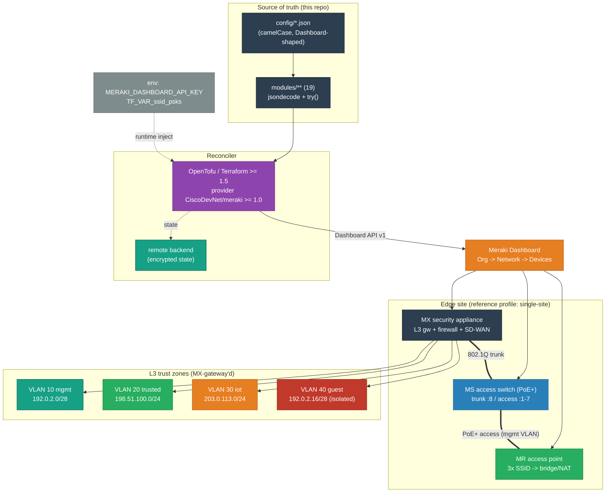

# Meraki Edge Network — Low-Level Design

<!-- START_GENERATED:docs/diagrams/src/lld_topology.mermaid -->

<!-- END_GENERATED:docs/diagrams/src/lld_topology.mermaid -->

The topology above is the [HLD's agnostic overview](HLD.md#6-architecture) made concrete: named
products, real (documentation-range) addresses, the actual wiring. This document is the reproducible
*how* — every resource, the apply order the API demands, the JSON schema gotchas that bite, and the
exact secret flow. It pairs with the [HLD](HLD.md) (the *why*); each concrete choice here traces back
to an ADR.

## Contents

0. [Environment Profiles](#environment-profiles)
1. [Component Inventory & Versions](#1-component-inventory--versions)
2. [Concrete Topology / Addressing](#2-concrete-topology--addressing)
3. [The Deliverable: Structure](#3-the-deliverable-structure)
4. [Configuration — Concrete](#4-configuration--concrete)
5. [Secrets — Concrete Wiring](#5-secrets--concrete-wiring)
6. [Networking — Concrete](#6-networking--concrete)
7. [State & Restore — Concrete Commands](#7-state--restore--concrete-commands)
8. [CI/CD Pipelines](#8-cicd-pipelines)
9. [Lifecycle Commands](#9-lifecycle-commands)
10. [Failure Modes](#10-failure-modes)

---

## Environment Profiles

The LLD is written against a **primary deployment profile**, concretely. Other targets are additive
profiles, not rewrites. This section is the contract a new profile must satisfy; the per-target
procedures live under [`runbooks/profile-*`](runbooks/README.md).

**Primary profile: `single-site`** — one organization, one network, one edge site (MX + MS + MR),
four trust zones, one encrypted remote state ([ADR-0008](adr/0008-deployment-profile-single-site.md)).
This is the simplest fully-specifiable shape and the one every address and apply-order below assumes.

Each profile specifies the same axes, so swapping targets is mechanical:

| Axis | `single-site` (primary) | `multi-site` (extension) |
|---|---|---|
| Org / network cardinality | 1 org → 1 network | 1 org → N networks (one `config/` set each) |
| Config selection | `config_path = ./config` | `config_path = ./environments/<site>/config` |
| State scoping | one state, one backend key | per-site state: workspace **or** separate backend key |
| Apply granularity | one apply | one apply *per site*, serialized (rate-limit safe) |
| Blast radius | site-local by definition | site-local per state; never org-wide in one apply |
| Engine | OpenTofu/Terraform ≥ 1.5 | same |

**What stays profile-independent** (the 19 modules, the JSON config pattern, the dependency graph,
the secret flow): everything except `config_path`/workspace selection and state scoping. The
`meraki_*` resources, the `try()`-driven JSON decode, and the `depends_on` chain do not change. A
material switch (e.g. to shared single-state, or to a managed multi-site wrapper) earns its own ADR.

---

## 1. Component Inventory & Versions

Concrete products and pinned versions (the *what*; the *why-this-one* is in the ADRs).

| Component | Product / Version | Role |
|---|---|---|
| Reconciler engine | OpenTofu ≥ 1.5 (Terraform ≥ 1.5 interchangeable) | computes + applies the declared end-state ([ADR-0007](adr/0007-opentofu-vs-terraform.md)) |
| Provider | `CiscoDevNet/meraki` ≥ 1.0.0 | drives the Meraki Dashboard API v1 |
| Security appliance | MX-class (e.g. MX67/MX68) | edge L3 gateway, firewall, SD-WAN |
| Access switch | MS-class PoE+ (e.g. MS120-8P) | L2/L3 access + PoE+ to the AP |
| Access point | MR/CW-class Wi-Fi 6 (e.g. MR44) | wireless overlay, SSID→zone |
| State backend | encrypted remote (GCS / S3 / TF Cloud) | operator-chosen; state is recovery truth |
| JSON lint (optional) | `jq` | config validation in CI |

Provider pin lives in `terraform/versions.tf`; engine floor is `required_version >= 1.5.0`.

## 2. Concrete Topology / Addressing

All addresses are **RFC 5737 documentation ranges** — nothing here maps to a real deployment.

| VLAN | Name | Subnet | Gateway | DHCP lease | Zone role |
|---|---|---|---|---|---|
| 10 | `mgmt` | `192.0.2.0/28` | `192.0.2.1` | 1 day | device/AP management |
| 20 | `trusted` | `198.51.100.0/24` | `198.51.100.1` | 1 day | trusted wired/wireless clients |
| 30 | `iot` | `203.0.113.0/24` | `203.0.113.1` | 12 h | IoT/sensors (least trust) |
| 40 | `guest` | `192.0.2.16/28` | `192.0.2.17` | 1 h | guest Wi-Fi (isolated/NAT) |
| 50 | `voice` | *(switch-port voice VLAN)* | — | — | voice on access port |

Physical wiring (single site): ISP → MX WAN1; MX trunk port ↔ MS trunk port (802.1Q, native VLAN 10);
MS access port → MR (PoE+, mgmt VLAN). Device serials/org ID are `REPLACE_*` placeholders in
`config.example/`.

## 3. The Deliverable: Structure

The artifact lives under [`../terraform/`](../terraform/README.md): a root composition plus **19
single-concern modules**, one per Dashboard section. The root (`main.tf`) loads each JSON config into
a `local`, then instantiates each module, wiring `organization_id` org→network and `network_id`
network→every device module, with `depends_on` enforcing apply order.

```
terraform/
├── main.tf        # root composition: jsondecode locals + module instantiation + depends_on chain
├── variables.tf   # meraki_api_key (sensitive) · config_path · ssid_psks (sensitive map)
├── outputs.tf     # organization_id, network_id, vlan ids, fw rule count, ssid names, ...
├── versions.tf    # required_version >= 1.5; provider CiscoDevNet/meraki >= 1.0.0
├── config.example/  # org · network · devices · mx/* · ms/* · mr/*  (committed, sanitized)
└── modules/
    ├── org/ network/ devices/
    ├── mx/{settings,vlans,firewall,vpn,routing,ports,traffic_shaping}/
    ├── ms/{settings,ports,qos,routing,stp,acl}/
    └── mr/{settings,ssids,rf_profiles}/
```

### Module reference

| Module | Provider resource(s) | Config file |
|---|---|---|
| `org` | `meraki_organization` (count, opt-in `manage`) | `org/organization.json` |
| `network` | `meraki_network` | `network/network.json` |
| `devices` | `meraki_network_device_claim`, `meraki_device` | `devices/devices.json` |
| `mx/settings` | `meraki_appliance_vlans_settings` | `mx/settings.json` |
| `mx/vlans` | `meraki_appliance_vlan` (for_each) | `mx/vlans.json` |
| `mx/firewall` | `meraki_appliance_l3_firewall_rules`, `_l7_firewall_rules` | `mx/firewall.json` |
| `mx/vpn` | `meraki_appliance_site_to_site_vpn`, `_vpn_bgp` | `mx/vpn.json` |
| `mx/routing` | `meraki_appliance_static_route` (for_each) | `mx/routing.json` |
| `mx/ports` | `meraki_appliance_port` (for_each) | `mx/ports.json` |
| `mx/traffic_shaping` | `meraki_appliance_traffic_shaping_rules` | `mx/traffic_shaping.json` |
| `ms/settings` | `meraki_switch_settings` | `ms/settings.json` |
| `ms/ports` | `meraki_switch_port` (for_each) | `ms/ports.json` |
| `ms/qos` | `meraki_switch_qos_rule`, `_dscp_to_cos_mappings` | `ms/qos.json` |
| `ms/routing` | `meraki_switch_routing_interface/_static_route/_ospf` | `ms/routing.json` |
| `ms/stp` | `meraki_switch_stp` | `ms/stp.json` |
| `ms/acl` | `meraki_switch_access_control_lists` | `ms/acl.json` |
| `mr/settings` | `meraki_wireless_settings`, `_network_bluetooth_settings` | `mr/settings.json` |
| `mr/ssids` | `meraki_wireless_ssid` (for_each) | `mr/ssids.json` |
| `mr/rf_profiles` | `meraki_wireless_rf_profile` (for_each) | `mr/rf_profiles.json` |

### Apply order (the dependency chain — [ADR-0006](adr/0006-dependency-ordering.md))

| Order | Resource(s) | Module |
|---|---|---|
| 1 | `meraki_organization` | org |
| 2 | `meraki_network` | network |
| 3 | `meraki_network_device_claim`, `meraki_device` | devices |
| 4 | `meraki_appliance_vlans_settings` **(enables VLANs first)** | mx/settings |
| 5 | `meraki_appliance_vlan` | mx/vlans |
| 6 | mx firewall / vpn / routing / ports / traffic_shaping | mx/* |
| 7 | `meraki_switch_settings` | ms/settings |
| 8 | ms ports / qos / routing / stp / acl | ms/* |
| 9 | `meraki_wireless_settings` | mr/settings |
| 10 | `meraki_wireless_ssid`, `meraki_wireless_rf_profile` | mr/ssids, mr/rf_profiles |

## 4. Configuration — Concrete

Every module takes a `config` of type `any`, decoded from JSON; `try()` makes fields optional
([ADR-0002](adr/0002-json-driven-config-pattern.md)).

```hcl
# Root main.tf — load (missing file = clean default)
locals {
  cfg             = var.config_path
  mx_vlans_config = try(jsondecode(file("${local.cfg}/mx/vlans.json")), { vlans = [] })
}

module "mx_vlans" {
  source     = "./modules/mx/vlans"
  network_id = module.network.network_id
  config     = local.mx_vlans_config
  depends_on = [module.mx_settings] # VLANs must be enabled first
}
```

```hcl
# modules/mx/vlans/main.tf — for_each over JSON, try() per optional field
resource "meraki_appliance_vlan" "this" {
  for_each      = { for v in try(var.config.vlans, []) : v.id => v }
  network_id    = var.network_id
  vlan_id       = each.value.id
  name          = each.value.name
  subnet        = each.value.subnet
  appliance_ip  = each.value.applianceIp
  dhcp_handling = try(each.value.dhcpHandling, null)
}
```

JSON keys are **camelCase** to match the Dashboard API verbatim:

```json
{ "id": "20", "name": "trusted", "subnet": "198.51.100.0/24",
  "applianceIp": "198.51.100.1", "dhcpHandling": "Run a DHCP server" }
```

### Schema notes that bite (from real provider behavior)

- **`vlan_id` and SSID `number` are strings**, not numbers — `"20"`, `"0"`.
- **`meraki_appliance_l3_firewall_rules` holds the entire ordered rule list in one resource**, not
  one resource per rule — the default-deny is the last element of that list.
- **`meraki_switch_port` keys on `serial` + `port_id`**, so ports can only be managed once the device
  serial is known (hence the device-claim ordering).
- **`use_vlan_tagging`** on an SSID is only meaningful in `Bridge mode` / `Layer 3 roaming`; the
  module derives it with `contains([...], ipAssignmentMode)`.
- **`meraki_appliance_vlans_settings` must enable VLANs before any `meraki_appliance_vlan`** can be
  created — the `mx/settings → mx/vlans` `depends_on` exists for exactly this.

## 5. Secrets — Concrete Wiring

Per [ADR-0005](adr/0005-secrets-out-of-repo.md), only structure is committed; values inject at
runtime.

| Secret | Injection | Consumed by |
|---|---|---|
| API key | `MERAKI_DASHBOARD_API_KEY` env (provider reads directly) **or** `TF_VAR_meraki_api_key` | `provider "meraki"` |
| SSID PSKs | `TF_VAR_ssid_psks='{"edge-trusted":"...","edge-iot":"..."}'` (sensitive map) | `mr/ssids`, looked up by SSID name |
| State | encrypted remote backend | the reconciler |

```hcl
# root variables.tf — PSK map is sensitive and defaults empty
variable "ssid_psks" {
  type      = map(string)
  sensitive = true
  default   = {}
}

# root main.tf — wired into mr/ssids (this repo fixes the v1 gap where it wasn't passed)
module "mr_ssids" {
  source    = "./modules/mr/ssids"
  config    = local.mr_ssids_config
  ssid_psks = var.ssid_psks
}

# modules/mr/ssids/main.tf — PSK pulled from the map, never from JSON
psk = try(each.value.authMode, "open") == "psk"
  ? lookup(var.ssid_psks, each.value.name, null)
  : null
```

The CI gate (`scripts/validate.sh`) greps tracked non-doc files for private-key blocks, AWS keys, and
inline passwords; the scoped `.gitignore` excludes `*.tfvars`, `*.tfstate*`, `.terraform/`, and the
live `config/` dir — but **not** the `.tf` source or `config.example/` JSON.

## 6. Networking — Concrete

The reference firewall (top-down, first-match, terminal logged deny — [ADR-0004](adr/0004-default-deny-firewall.md)):

| # | Policy | Src | Dest | Syslog | Intent |
|---|---|---|---|---|---|
| 1 | allow | `198.51.100.0/24` (trusted) | `192.0.2.0/28` (mgmt) | ✗ | trusted may manage |
| 2 | deny | `203.0.113.0/24` (iot) | `198.51.100.0/24` (trusted) | ✓ | IoT cannot reach trusted |
| 3 | deny | `192.0.2.16/28` (guest) | `10.0.0.0/8` (RFC 1918) | ✓ | guest cannot reach private space |
| 4 | **deny** | any | any | ✓ | **explicit default-deny** |

Switching: trunk port 802.1Q carries all VLANs (native VLAN 10); access ports pin one zone; RSTP +
BPDU guard on edge ports. Wireless: `edge-trusted` → bridge VLAN 20, `edge-iot` → bridge VLAN 30
(hidden), `edge-guest` → NAT/isolated with click-through splash. WAN: MX WAN1 primary, optional
LTE/5G failover (SD-WAN — [HLD §2](HLD.md#2-the-workload--problem-under-design)).

## 7. State & Restore — Concrete Commands

The two recovery assets ([HLD §9](HLD.md#9-backup-recovery--operations)): the **declared intent**
(git) and the **reconciler state** (encrypted backend).

```bash
# State lives in an encrypted remote backend (operator-chosen). Example block:
#   terraform { backend "gcs" { bucket = "REPLACE_STATE_BUCKET"; prefix = "meraki/single-site" } }

# Restore drill: re-derive the whole network into a scratch org from the artifact alone.
export MERAKI_DASHBOARD_API_KEY="REPLACE_SCRATCH_KEY"
cp -r terraform/config.example /tmp/drill-config
# edit /tmp/drill-config/org/organization.json -> scratch org id
( cd terraform && tofu plan -var="config_path=/tmp/drill-config" )   # must converge clean
```

RPO ≈ 0 for intent (every change is a commit), bounded by backend versioning for state. RTO to
rebuild a site ≈ apply time + license/claim latency.

## 8. CI/CD Pipelines

Gates, in order — mirrored locally by [`../scripts/validate.sh`](../scripts/README.md):

1. **Doc-sync** — `build_docs.py` re-injects diagrams; a second pass must be a no-op (catches a
   hand-edited generated block).
2. **`tofu fmt -check -recursive`** — style gate.
3. **`tofu validate`** (after `tofu init -backend=false`) — HCL + provider-schema validity, no API key
   needed.
4. **Secret scan** — grep tracked non-doc files for secret material.
5. *(optional)* `jq` lint of every `config.example/**/*.json`.

Applies are **serialized per org** (CI concurrency lock) to stay under the Dashboard API rate limit;
**`plan` is scheduled for drift detection, `apply` is gated behind a human** ([COST-MODEL §3 traps](COST-MODEL.md#3-️-runtime--operational-cost-traps-read-before-deploying)).

## 9. Lifecycle Commands

```bash
# Onboard / first apply
export MERAKI_DASHBOARD_API_KEY="REPLACE_API_KEY"
export TF_VAR_ssid_psks='{"edge-trusted":"REPLACE","edge-iot":"REPLACE","edge-guest":"REPLACE"}'
cp -r terraform/config.example terraform/config        # then edit org id, serials
( cd terraform && tofu init && tofu plan && tofu apply )

# Change: edit JSON -> review the diff -> apply
( cd terraform && tofu plan && tofu apply )

# Drift detection (schedule this; do NOT schedule apply)
( cd terraform && tofu plan -detailed-exitcode )       # exit 2 = drift

# Rollback: revert the intent, re-apply
git revert <bad-commit> && ( cd terraform && tofu apply )

# Decommission (verify no orphans afterward)
( cd terraform && tofu destroy )
```

## 10. Failure Modes

| Failure | Presents as | Detected by | Recovery |
|---|---|---|---|
| VLANs not enabled before create | `apply` error on `meraki_appliance_vlan` | apply log | the `mx/settings → mx/vlans` `depends_on` prevents it; if hit, re-run after settings apply |
| Port managed before device claimed | `meraki_switch_port` not-found on serial | apply log | claim ordering via `devices` dep; re-apply |
| API rate-limit storm (`429`) | applies slow / CI stalls | `429` in logs ([HLD R4](HLD.md#12-risks--open-questions)) | serialize applies; back off; no parallel apply per org |
| Out-of-band Dashboard edit | next `plan` shows unexpected diff ([HLD R3](HLD.md#12-risks--open-questions)) | scheduled drift plan | re-apply (reconcile) or `tofu import` the change |
| Missing PSK env var | SSID applies with null PSK | smoke test (clients can't auth) | export `TF_VAR_ssid_psks`; re-apply |
| License capacity exhausted on claim | claim apply fails / org re-prices ([HLD R2](HLD.md#12-risks--open-questions)) | pre-apply license check; billing alert | pre-stage license headroom before claim apply |
| Lost state | apply wants to recreate everything | plan shows full create | restore from backend versioning; re-derive from git as last resort |

These rows tie to the [HLD risk register](HLD.md#12-risks--open-questions) and the
[troubleshooting runbook](runbooks/profile-single-site/09-troubleshooting/RUNBOOK.md).

## 11. Field-Tested Quirks (provider behavior proven on a live network)

These are the exact things that bite when you run this against real Meraki hardware, each surfaced
during a live brownfield adoption. None are in the provider docs prominently; all cost time once.

| # | Quirk | Symptom | Handling (in this repo) |
|---|---|---|---|
| NQ-1 | **`SUCCESS` ≠ no-op.** A green `apply` does not prove zero drift. | Build passes, drift still present. | Assert the literal `0 to change` / `No changes` line; use `plan -detailed-exitcode` (exit 0) in CI, never the apply banner. |
| NQ-2 | **`optional(x, "literal")` force-writes attrs the live object omits.** | Perpetual `1 to change` on a no-op (e.g. a no-DHCP VLAN). | Default omittable attributes to **null**, not a literal, so the provider leaves them unset. Modules here use `try(..., null)` throughout. |
| NQ-3 | **Disabled switchport rejects `allowedVlans`.** API returns 400 ("enable the port first"); GET omits the attr on disabled ports. | `apply` 400 on a disabled port; or perpetual diff. | `ms/ports` emits `allowed_vlans` only when `enabled = true` (disabled-port guard); reconcile with `-refresh-only`. |
| NQ-4 | **`import{}` blocks force a non-zero plan.** | `plan -detailed-exitcode` returns **2** during import. | Exit 2 = "changes present", not error. CI treats exit 2 as success for the import stage (only 1 is failure). See [runbook 08](runbooks/profile-single-site/08-brownfield-import/RUNBOOK.md). |
| NQ-5 | **Optional-var-via-`local` must also update the module OUTPUT.** | Downstream `terraform_remote_state` reader gets a stale/absent value. | When a value is computed in `locals`, surface it through the module `outputs.tf`, not just the resource arg. |
| NQ-6 | **`stp_bridge_priority` is an attribute, not a block; provider needs an explicit `api_key`.** | Cryptic schema error / unauthenticated calls. | Set `stp_bridge_priority = N` as an attribute; provider config passes `api_key = var.meraki_api_key` explicitly. |
| NQ-7 | **Broad `*.tfvars.json` gitignore swallows site config.** | Your `*.auto.tfvars.json` silently untracked. | Scope the ignore: block secret-bearing values only (`!*.auto.tfvars.json` then re-block `*-secret.auto.tfvars.json`); `git check-ignore <file>` before assuming it's tracked. |

> The companion to NQ-3 at the platform layer: if you front this network with a Kubernetes
> LoadBalancer (e.g. MetalLB), note that a **branch MX in routed/NAT mode does not support appliance
> BGP** — the API returns `400 Feature only supported for VPN participants` then
> `400 ... without passthrough mode enabled`. Behind a branch MX, **MetalLB L2 mode is the correct
> choice** (the VIP pool must share the nodes' L2 segment); BGP/ECMP needs a dedicated concentrator or
> an L3 switch. Don't imply BGP is a drop-in.

The brownfield workflow that surfaced most of these is [ADR-0009](adr/0009-brownfield-import-workflow.md)
and [runbook 08](runbooks/profile-single-site/08-brownfield-import/RUNBOOK.md).
