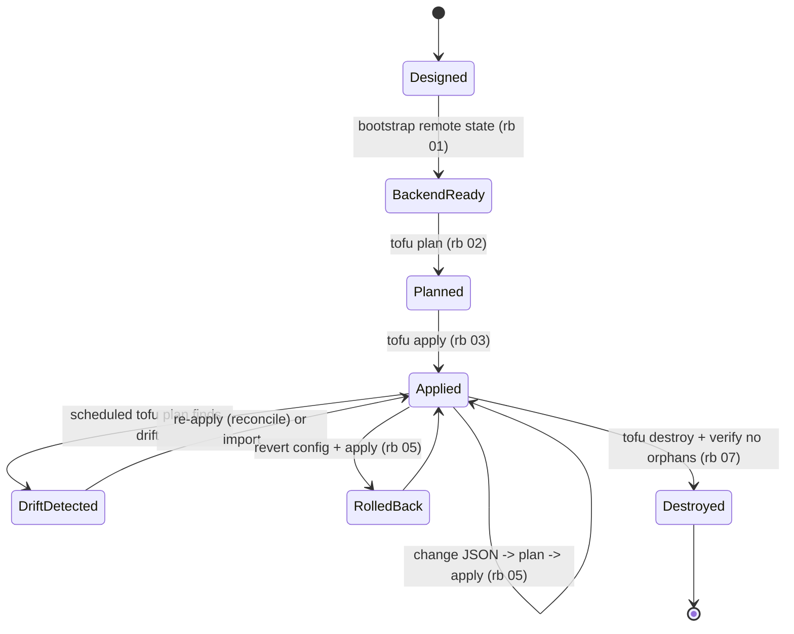

# Meraki Edge Network — Operations & Support

> The full operate-and-support picture, not just install. The README's Lifecycle section is the map;
> this is the territory. The [runbooks](runbooks/README.md) are the *procedures*; this doc is the
> *operating model* — when to run them, who owns what, and how you know the network is healthy.

The lifecycle, as a state machine:

<!-- START_GENERATED:docs/diagrams/src/lifecycle.mermaid -->

<!-- END_GENERATED:docs/diagrams/src/lifecycle.mermaid -->

---

## Day-0 — Provision (stand it up)

What must exist before the edge config lands: an **encrypted, versioned remote state backend**
([runbook 01](runbooks/_common/01-bootstrap-backend/RUNBOOK.md)), a **Dashboard API key** with
org read/write and the **SSID PSK map** ([runbook 03](runbooks/profile-single-site/03-secrets/RUNBOOK.md)),
and the **org/network/device-claim substrate**
([runbook 02](runbooks/profile-single-site/02-provision-org-network/RUNBOOK.md)). Exit criterion:
`tofu init` binds to remote state, the provider authenticates, the network exists, and devices are
claimed with **license headroom confirmed**.

## Day-1 — Deploy (land the config)

First full `plan` → reviewed diff → `apply`
([runbook 04](runbooks/profile-single-site/04-plan-and-apply/RUNBOOK.md)). Exit criterion: the edge
serves — segmentation enforced, the firewall ends in a logged default-deny, switch ports and SSIDs
match intent — a second `plan` is empty, and the rollback path (revert + apply) is understood.

## Day-2 — Operate (run it like it matters)

The steady state, where most of the real cost and risk live. The change loop is itself declarative:
edit JSON → review the plan → apply ([runbook 05](runbooks/_common/05-update-and-rollback/RUNBOOK.md)),
never an out-of-band Dashboard click.

### Monitoring & Observability

| Signal | What it tells you | Source | Alert threshold |
|---|---|---|---|
| Uplink / appliance reachability | the edge is up and forwarding | Dashboard / uplink monitoring | down > 5m |
| **Config drift** | live network diverged from declared intent | scheduled `tofu plan -detailed-exitcode` ([rb 06](runbooks/profile-single-site/06-drift-detection/RUNBOOK.md)) | exit code 2 (non-empty diff) |
| **License / spend** | a claim re-priced the pool; expiry approaching | Dashboard License info + billing | any unplanned charge; expiry < 30d |
| API health | applies/plans succeeding | apply/plan logs | `429` rate-limit or auth errors |
| State backend | recovery truth intact | backend object versioning | write failure / missing object |
| Apply outcome | changes converge | CI / `plan -detailed-exitcode` | non-zero after apply |

> **Drift and spend are first-class operational signals here** — the network analogue of watching
> agent token spend. Schedule a daily *read-only* `plan` for drift; treat every device-claim apply as
> a budget event. See [COST-MODEL §3 traps](COST-MODEL.md#3-️-runtime--operational-cost-traps-read-before-deploying).

### Capacity & Scaling

Scale by **adding a configuration set** (a new site under the multi-site profile), not by enlarging
one monolithic state. Within a site, capacity is the hardware envelope (PoE budget, AP client count,
MX throughput tier) — track it, and grow by claiming devices (a budget event) or moving up a license
tier, never by hand-clicking config that drift then erases.

### Upgrade & Patch Cadence

- **Config (this repo):** push-to-apply, reviewed diff; cadence is on-demand per change.
- **Provider pin:** bump deliberately, re-`validate`, re-`plan` before apply; pin + commit the lock in
  real deployments (a moving `>=` can change resource behavior mid-apply).
- **Device firmware:** an **imperative action**, owned out of band (a scheduled firmware window in the
  Dashboard), not by this repo — declarative for state, imperative for actions
  ([ADR-0001](adr/0001-declarative-over-imperative.md)).
- Change is **declarative** — a `plan`+`apply`, never an out-of-band edit that the next reconcile
  erases.

### State Backup & Restore (verified)

- **RPO ≈ 0** for declared intent (every change is a commit); state RPO is bounded by backend
  versioning.
- **RTO** to rebuild a site ≈ apply time + license/claim latency.
- **A state backup nobody has restored is not a backup** — the restore drill
  ([LLD §7](LLD.md#7-state--restore--concrete-commands)) re-derives the network into a scratch org and
  confirms the plan converges clean. The repo itself (declared intent in git) is the ultimate DR asset.

## Support Model & Break-Fix

| Tier | Scope | Owner | Where |
|---|---|---|---|
| Self-correct | reconcile drift back to intent on the next scheduled plan/apply | the workflow (semi-automatic) | [rb 06](runbooks/profile-single-site/06-drift-detection/RUNBOOK.md) |
| Operator | break-fix, rollback, state restore, import | you / network eng | [rb 09 troubleshooting](runbooks/profile-single-site/09-troubleshooting/RUNBOOK.md), [rb 05](runbooks/_common/05-update-and-rollback/RUNBOOK.md) |
| Escalation | platform/control-plane, hardware RMA, licensing | Meraki / vendor support | Dashboard support case |

- **On-call posture:** realistic for a small fleet — best-effort/business-hours; the data plane keeps
  forwarding if the cloud control plane is briefly unreachable (only *config changes* degrade — an
  accepted SD-WAN trade-off, [HLD R1](HLD.md#12-risks--open-questions)).
- **Known failure modes → response:** mirror the [LLD failure-modes table](LLD.md#10-failure-modes)
  and the [HLD risk register](HLD.md#12-risks--open-questions); every row points to a runbook.

## Day-N — Decommission (retire cleanly)

`tofu destroy` → release claimed devices from the org → park/review licenses → delete the state object
and (if dedicated) its bucket → archive the repo at a `decommission/<date>` tag. **Leaving no
orphaned config, device, license, or state bucket behind is part of the job.** The orphan checklist
and verification are in [runbook 07](runbooks/_common/07-decommission/RUNBOOK.md).
